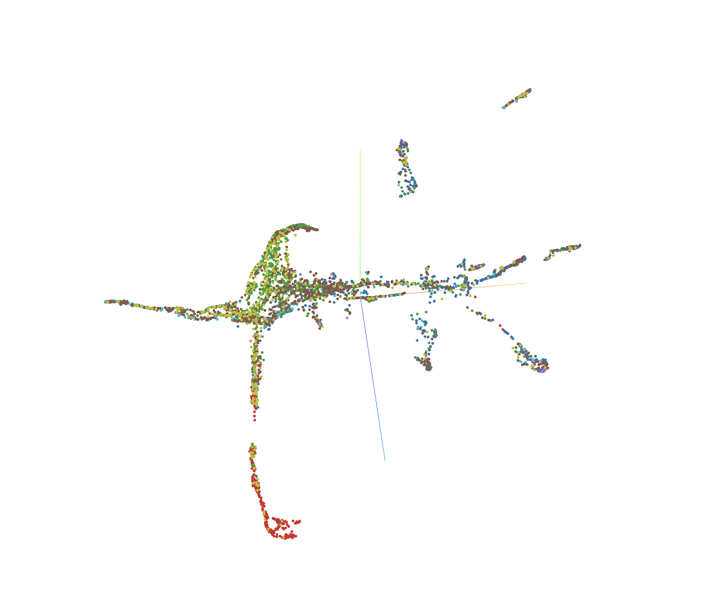
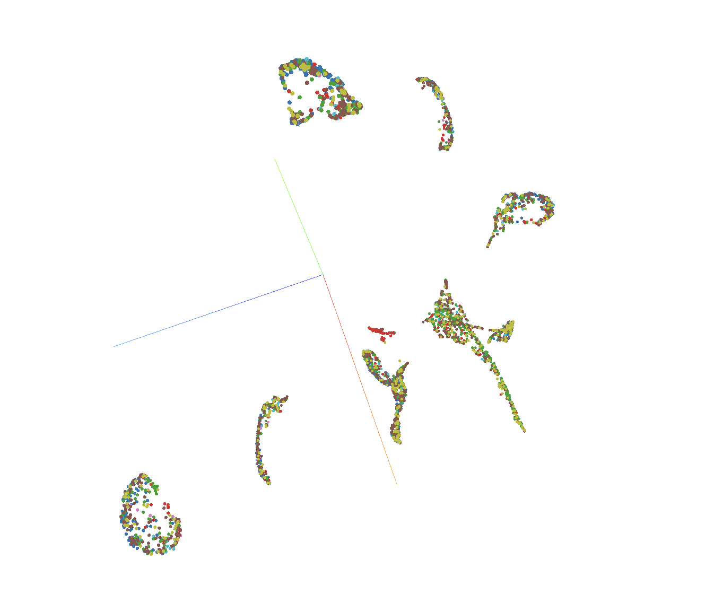

## embedding-projector 
[Solution
page](https://album.cellcanvas.org/cellcanvas/embedding-projector/0.0.2)

Get started installing the solution by following [these
instructions](https://album.solutions/guide?catalog_url=https://github.com/cellcanvas/album-catalog&catalog_name=cellcanvas&group=cellcanvas&name=embedding-projector&version=0.0.2)

--

### Running embedding-projector
You can run 

```sh
album run cellcanvas:embedding-projector:0.0.2 \
    --embeddings embedding_store_path \
    --labels label_store_path
```




