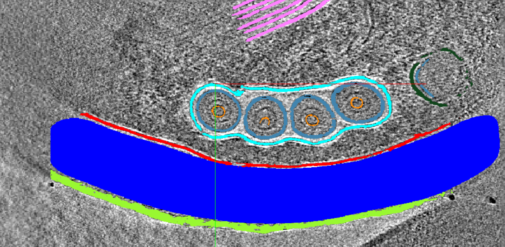

## Welcome to the Album Setup Tutorial for Cryo-ET applications

This tutorial will guide you through setting up Album on your machine.

Image from https://cryoetdataportal.czscience.com/runs/15936

August 14, 2024  
Kyle Harrington and Zhuowen (Kevin) Zhao  
CZ Imaging Institute

---

FILE: overview.md

---

FILE: getting-started.md

---

FILE: napari-copick.md

---

FILE: embedding-projector.md

---

FILE: slurm-array.md

---

FILE: paint-from-picks.md

---

FILE: generate-skimage-features.md

---

FILE: picks-from-segmentation.md

---

FILE: ../resources.md
